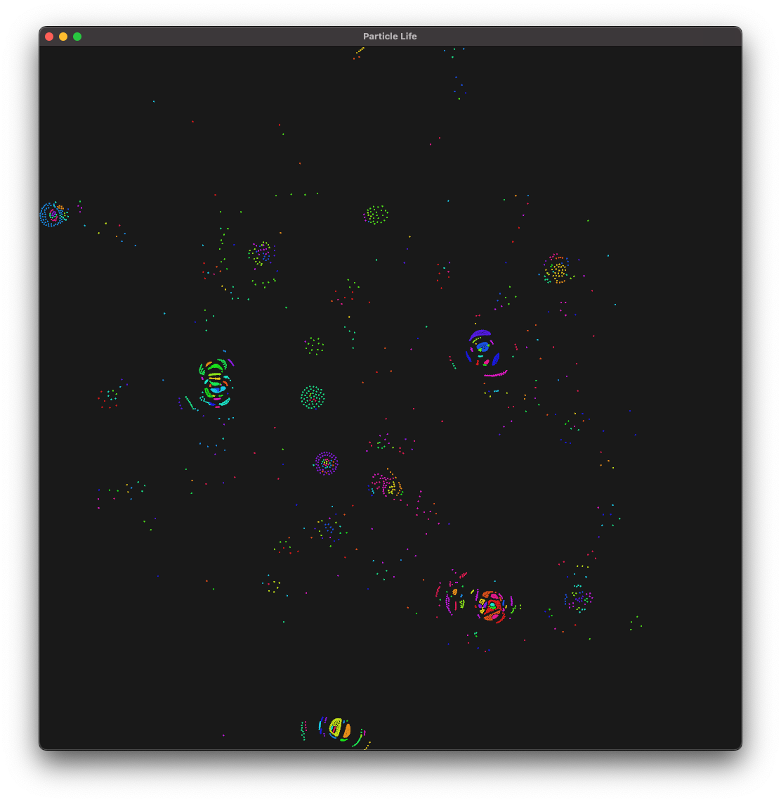

# Particle Life

<div align="center">
    
</div>

Emergent behavior simulation



## About

Particle Life is a simulation of emergent behavior.
It was inspired by [Conway's Game of Life](https://en.wikipedia.org/wiki/Conway%27s_Game_of_Life) and [Boids](https://en.wikipedia.org/wiki/Boids).

The simulation is very simple.
A finite collection of particles are spawned randomly across a 2D plane.
Each particle is randomly assigned a colour, which determines the force it exerts on other particles.

## Quickstart

Clone this repository, and set the current working directory to the root of the project:

```shell
git clone https://FreddyWordingham/ParticleLife
cd ParticleLife
```

Build and run the project using the Rust toolchain:

```shell
cargo run --release this_is_the_seed
```

Note you must give the simulation a seed, in the form of a string, to use.
This is used to seed the random number generator used to generate the attraction matrix of the simulation.
The initial particle positions will be random each time.
